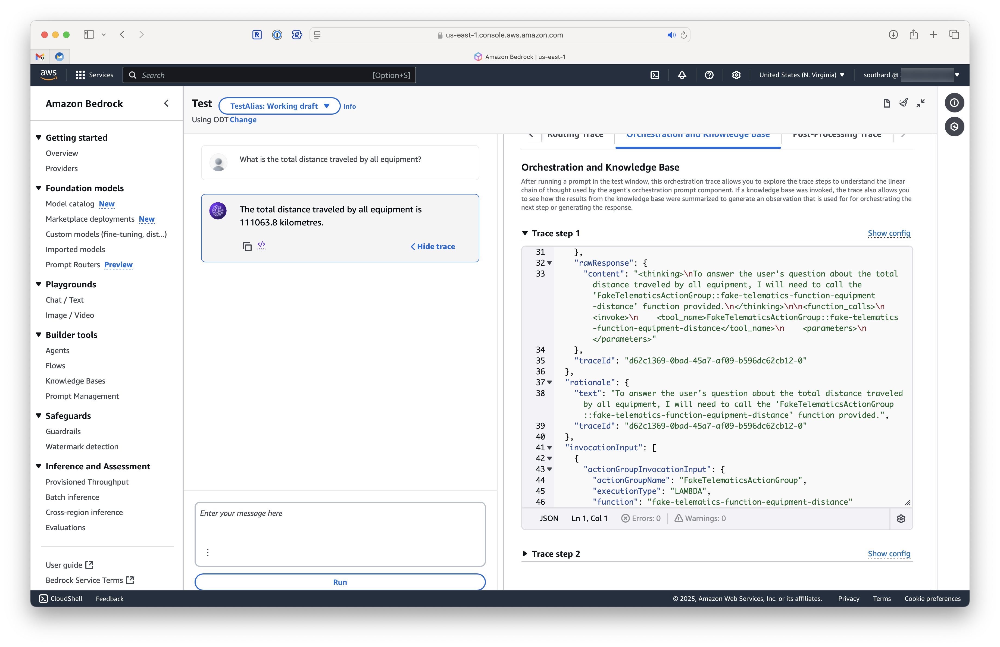
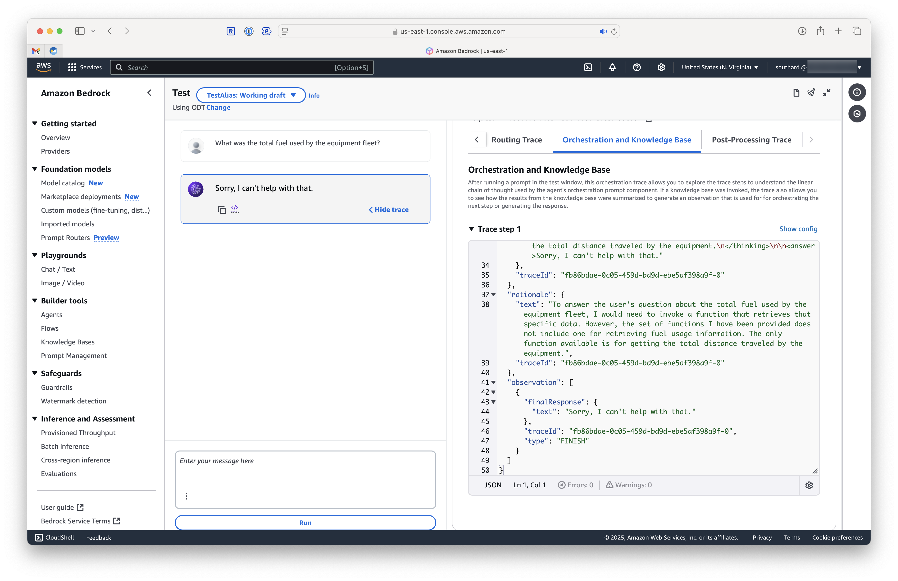

# AWS Bedrock Agents

This repository contains a Terraform configuration for a Bedrock agent and a lambda function that it uses to call an external mock API for a subset of telematics data.

## Background

This repository is part of a series of repositories that I'm creating to test and explore the various features of AWS Bedrock.

| Concept / Example | Repository  |
|:--|:--|
| AWS Bedrock + Langchain  | https://github.com/chaserx/aws-llm-basic  |
| ChromaDB: Document addition and retrieval | https://github.com/chaserx/chroma_simple |
| ChromaDB: Data embedding and search | https://github.com/chaserx/chroma_langchain_embedding_retrieval |
| Pinecone Vector DB setup task: index creation  | https://github.com/chaserx/pinecone_quickstart  |
| Using LangSmith | https://github.com/chaserx/langsmith_simple  |
| AWS Bedrock Knowledge Bases | https://github.com/chaserx/bedrock_kb_rag  |
| AWS Bedrock Agents | https://github.com/chaserx/bedrock_agents 👈 You are here |

What I've learned so far:

- If you want to return a precise answer, you can't rely on the model to deduce the answer. You need to either use a tool to call an external API or have a model that can write code to query a database or other data source.
- Agents can be created using the AWS Bedrock console or using Terraform. While more difficult to do, the Terraform configuration allows for more control over the resources created and can be easier to manage.
- Agents have Action Groups that contain AWS Lambda functions, Knowledge Bases, and other resources.
- Agents understand what tools are available to them by looking at the functions defined in the Action Group using a natural language prompt ([example](https://github.com/chaserx/bedrock_agents/blob/8677717adc323457152860466848efea7c678628/main.tf#L113)).

## Requirements

- AWS account
- AWS Bedrock model providers
  - e.g., Claude 3.5 Sonnet

## Setup

### AWS Bedrock

- Enable a Bedrock model provider
- Create a new Bedrock agent
  - Add the agent's name and description
  - Add a persona for the agent
  - Add tools for the agent to use
- Create a new Bedrock agent deployment
  - Add the agent to the deployment
  - Configure the deployment with the desired settings
    - e.g., model provider, temperature, max tokens, etc.

### AWS Lambda

- Deploy the lambda function outlined below for the agent to use

## Usage

### AWS Bedrock Chat

- Use the agent in a chat with a prompt like:

```plaintext
What is the total distance traveled by all equipment?
```

---

## Fake Telematics Lambda Function

This is a simple lambda function that returns a JSON object (stored in the `src/data/telematics_data.json` file) as the body of the response. The lambda function is configured to be called by the agent when the user asks for the total distance traveled by all equipment.

### Prerequisites

- [Terraform](https://terraform.io/)
- [AWS CLI](https://awscli.amazonaws.com/v2/documentation/api/latest/reference/index.html)
  - AWS account
  - Configured AWS CLI
- [Python 3.13](https://www.python.org/downloads/) - The lambda function is written in Python 3.13. Use [UV](https://docs.astral.sh/uv/getting-started/installation/) to install Python 3.13 and manage dependencies.
- [jq](https://stedolan.github.io/jq/) (optional, for displaying the response in a readable format)

### Dependencies

The lambda function currently has 1 dependency: `inflect`. You can manage the dependencies using [uv](https://docs.astral.sh/uv/getting-started/installation/) like so:

```bash
uv add <dependency>
```

Terraform configuration is set to build the lambda function. UV has [documentation on how to build and deploy a zip archive](https://docs.astral.sh/uv/guides/integration/aws-lambda/#deploying-a-zip-archive) with the dependencies included. The steps are do this are in `build_lambda.sh`.

```terraform
# action group lambda function
module "lambda_function" {
  source  = "terraform-aws-modules/lambda/aws"
  version = "7.20.1"

  function_name = "fake-telematics-function-equipment-distance"
  description   = "A telematics function for getting the total distance traveled by all equipment"
  handler       = "src.fake_telematics.lambda_handler"
  runtime       = "python3.13"
  timeout       = 300
  create_package = false # <== This is required to prevent Terraform from building a zip file when the zip file already exists
  local_existing_package = "./fake_telematics.zip"
  ignore_source_code_hash = true # <== This is required to prevent Terraform from tracking changes to the zip file
  depends_on = [
    null_resource.uv_build # <== This is required to ensure the lambda function is built before it is deployed
  ]
}

# Build the lambda function zip file
resource "null_resource" "uv_build" {
  provisioner "local-exec" {
    command = "./build_lambda.sh" 
  }
}
```

### Deploying the lambda function using Terraform

On Mac OS, install terraform using Homebrew:

```bash
brew install terraform
```

Initialize the Terraform configuration:

```bash
terraform init
```

Plan the deployment:

```bash
terraform plan
```

Apply the configuration:

```bash
terraform apply
```

## Testing the lambda function

Invoke the lambda function:

```bash
aws lambda invoke --region us-east-1 --cli-binary-format raw-in-base64-out --payload '{ "actionGroup": "test-group", "function": "test-function", "messageVersion":"1" }' --function-name fake-telematics-function-equipment-distance response.json
```

Display the response:

```bash
cat response.json | jq
```

### Cleaning up

```bash
terraform destroy
```

### Updating the lambda function

```bash
terraform plan -out plan.tfplan
terraform apply plan.tfplan
```

### Testing the agent

#### Console

Test the agent in the AWS Bedrock Agent console.


#### CLI

You can also test the agent with an [Invoke Agent](https://docs.aws.amazon.com/bedrock/latest/APIReference/API_agent-runtime_InvokeAgent.html) POST request to the [AWS Bedrock build-time endpoint](https://docs.aws.amazon.com/general/latest/gr/bedrock.html#bra-bt):

## Troubleshooting  

### Agent not understanding the tool

If the agent is not understanding the tool, you can try the following:

- Ensure the tool is defined in the agent's action group
- Ensure the tool is defined in the agent's prompt

### Understanding the agent's reasoning

View the agent's reasoning in the AWS Bedrock Agent console by viewing the [trace](https://docs.aws.amazon.com/bedrock-agent/latest/userguide/agent-traces.html)




## Resources

- [AWS Bedrock](https://docs.aws.amazon.com/bedrock/latest/userguide/what-is-bedrock.html)
- [AWS Lambda](https://docs.aws.amazon.com/lambda/latest/dg/welcome.html)
- [AWS Bedrock Agents](https://docs.aws.amazon.com/bedrock-agent/latest/userguide/what-is-bedrock-agent.html)
- [AWS Bedrock Agent Actions](https://docs.aws.amazon.com/bedrock-agent/latest/userguide/agent-actions.html)
- [AWS Bedrock Agent Functions](https://docs.aws.amazon.com/bedrock-agent/latest/userguide/agent-functions.html)
- [AWS Bedrock Agent Function Schemas](https://docs.aws.amazon.com/bedrock-agent/latest/userguide/agent-function-schemas.html)
- [UV - AWS Lambda Deployment Package](https://docs.astral.sh/uv/guides/integration/aws-lambda/#deploying-a-zip-archive)
- [UV - AWS Lambda Example](https://github.com/astral-sh/uv-aws-lambda-example)
- [How to manage an Amazon Bedrock agent using Terraform](https://blog.avangards.io/how-to-manage-an-amazon-bedrock-agent-using-terraform)
